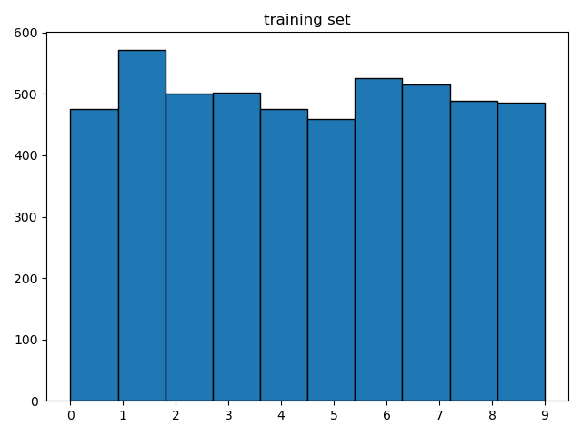

# active-learning-mnist

Course project for 02750 Automation of Scientific Research at CMU

This project compares different active learning methods on the [MNIST](https://www.openml.org/search?type=data&sort=runs&id=554) dataset.

## How to run

### Download code
```shell
git clone https://github.com/baolef/active-learning-mnist.git
cd active-learning-mnist
```

### Run experiments
```shell
python main.py
```

### Fine tuning
```shell
python svm.py # already run, can skip
python plot_svm.py
```

### Plot data visualization
```shell
python data.py
```

### Plot decision boundary
```shell
python boundary.py
```


## Dataset

To save computation, our training set contains 5000 images and test set contains 10000 images.

<p float="left">
  
  
</p>

## Experiment

The model we use is [SVM](https://scikit-learn.org/stable/modules/generated/sklearn.svm.SVC.html). We fine tune the hyperparameters of SVC, and find the optimal configuration `{'C': 100, 'kernel': 'poly', 'degree': 3}`.

<p float="left">
  
  
</p>

When sampling, the active learning pipeline starts with 100 samples and ends at 1000 samples, with a batch size of 10.

## Results

In the default SVM, density sampling performs the best, uncertainty sampling is unstable, and diversity sampling performs the worst.


In the default SVM, density sampling and uncertainty sampling performs the best, and diversity sampling performs the worst.


The animation shows how the decision boundary of uncertainty sampling in default SVM (left) and density sampling in optimal SVM (right) changes over iterations.
<p float="left">
  
  
</p>